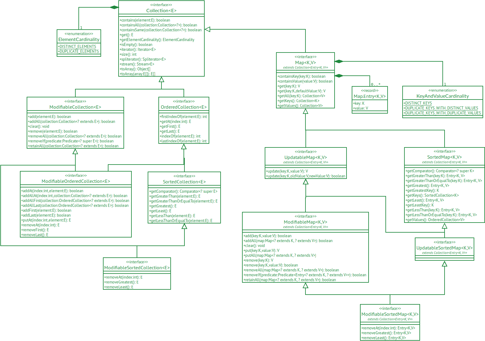

# Kolektoj — Yet Another Java Collections Framework

*“Kolektoj” is the Esperanto word for “collections”.*

The aim of this project is to provide a clean Java collections framework.

* [Design Principles](#design-principles)
* [Collection Properties](#collection-properties)
* [Overview](#overview)
* [Comparison with the Java Platform Collections Framework](#comparison-with-the-java-platform-collections-framework)
  * [JDK 17 Interfaces](#jdk-17-interfaces)
  * [JDK 17 Classes](#jdk-17-classes)
* [Getting Started](#getting-started)
* [Projects Using Kolektoj](#projects-using-kolektoj)

## Design Principles

* Collections come in different forms with different properties, and it should be possible for a developer to pick
  exactly the set of properties he needs for his software to do the job.
* Collection properties that don't have an influence on the API should be treated as attributes. This minimizes the
  number of interfaces in the framework.
* Methods should be declared at the hierarchy level where they start to make sense, and never higher than that.
* Behavioural specializations are not part of this framework. Examples of behavioural specializations are queues and
  stacks.
* Properties not specified by the developer may exhibit some default behaviour, but there is no requirement that the
  behaviour governed by an unspecified property is consistent within an implementation, or even within an instance of an
  implementation within its lifetime.

## Collection Properties

The following collection properties have been identified:

* Order: whether the elements in the collection have an order or not.
* Uniqueness: whether the collection can contain the same element more than once or not.
* Null: whether `null` is allowed as an element of the collection or not.
* Modifiability: whether the content of the collection can be modified or not, and if it can be modified, whether it's
  thread-safe or not.

## Overview



The table below shows the various implementations of the interfaces.

| Interface                   | Array                            | Hash              | Linked List                    | Sorted Tree                       |
|-----------------------------|----------------------------------|-------------------|--------------------------------|-----------------------------------|
| Collection                  | ArrayCollection                  |                   |                                | *SortedTreeCollection*¹           |
| ModifiableCollection        | ModifiableArrayCollection        |                   | ModifiableLinkedListCollection | *ModifiableSortedTreeCollection*¹ |
| OrderedCollection           | OrderedArrayCollection           | —²                |                                | *SortedTreeCollection*¹           |
| ModifiableOrderedCollection | ModifiableOrderedArrayCollection | —²                |                                | —²                                |
| SortedCollection            | SortedArrayCollection            | —²                |                                | SortedTreeCollection              |
| ModifiableSortedCollection  |                                  | —²                |                                | ModifiableSortedTreeCollection    |
| Map                         |                                  | HashMap           |                                | *SortedTreeMap*¹                  |
| UpdatableMap                |                                  | UpdatableHashMap  |                                | *UpdatableSortedTreeMap*¹         |
| ModifiableMap               |                                  | ModifiableHashMap |                                | *ModifiableSortedTreeMap*¹        |
| SortedMap                   | SortedArrayMap                   | —²                |                                |                                   |
| UpdatableSortedMap          |                                  | —²                |                                |                                   |
| ModifiableSortedMap         |                                  | —²                |                                |                                   |

¹ This implementation of the interface automatically provides functionality for a more specialized interface.

² The nature of this implementation conflicts with the functionality of this interface.

## Comparison with the Java Platform Collections Framework

The comparison below is based on the Java Platform
[Collections Framework Overview](https://docs.oracle.com/en/java/javase/17/docs/api/java.base/java/util/doc-files/coll-overview.html)
for JDK 17.

### JDK 17 Interfaces

The Java Platform Collections Framework contains the following interfaces in JDK 17:

* [java.util.Collection&lt;E>](#javautilcollectione)
* [java.util.List&lt;E>](#javautilliste)
* [java.util.Set&lt;E>](#javautilsete)
* [java.util.Map&lt;E>](#javautilmape)
* java.util.concurrent.BlockingDeque
* java.util.concurrent.BlockingQueue
* java.util.concurrent.ConcurrentMap
* java.util.concurrent.ConcurrentNavigableMap
* java.util.Deque
* java.util.NavigableMap
* java.util.NavigableSet
* java.util.Queue
* java.util.SortedMap
* java.util.SortedSet
* java.util.concurrent.TransferQueue

#### java.util.Collection&lt;E>

The table below shows how the methods defined on the
[java.util.Collection&lt;E>](https://docs.oracle.com/en/java/javase/17/docs/api/java.base/java/util/Collection.html)
interface map to Kolektoj methods.

| JDK 17 Method                                             | Kolektoj Class             | Kolektoj Method                                          |
|-----------------------------------------------------------|----------------------------|----------------------------------------------------------|
| boolean add(E e)                                          | ModifiableCollection&lt;E> | boolean add(E element)                                   |
| boolean addAll(Collection&lt;? extends E> c)              | ModifiableCollection&lt;E> | boolean addAll(Collection&lt;? extends E> collection)    |
| void clear()                                              | ModifiableCollection&lt;E> | void clear()                                             |
| boolean contains(Object o)                                | Collection&lt;E>           | boolean contains(E element)                              |
| boolean containsAll(Collection&lt;?> c)                   | Collection&lt;E>           | boolean containsAll(Collection&lt;?> c)                  |
| boolean equals(Object o)                                  |                            |                                                          |
| int hashCode()                                            |                            |                                                          |
| boolean isEmpty()                                         | Collection&lt;E>           | default boolean isEmpty()                                |
| Iterator&lt;E> iterator()                                 | Collection&lt;E>           | Iterator&lt;E> iterator()                                |
| default Stream&lt;E> parallelStream()                     |                            |                                                          |
| boolean remove(Object o)                                  | ModifiableCollection&lt;E> | boolean remove(E element)                                |
| boolean removeAll(Collection&lt;?> c)                     | ModifiableCollection&lt;E> | boolean removeAll(Collection&lt;? extends E> collection) |
| default boolean removeIf(Predicate&lt;? super E> filter)  | ModifiableCollection&lt;E> | boolean removeIf(Predicate&lt;? super E> predicate)      |
| boolean retainAll(Collection&lt;?> c)                     | ModifiableCollection&lt;E> | boolean retainAll(Collection&lt;? extends E> collection) |
| int size()                                                | Collection&lt;E>           | int size()                                               |
| default Spliterator&lt;E> spliterator()                   | Collection&lt;E>           | Spliterator&lt;E> spliterator()                          |
| default Stream&lt;E> stream()                             | Collection&lt;E>           | default Stream&lt;E> stream()                            |
| Object[] toArray()                                        | Collection&lt;E>           | E[] toArray()                                            |
| default &lt;T> T[] toArray(IntFunction&lt;T[]> generator) | Collection&lt;E>           | E[] toArray()                                            |
| &lt;T> T[] toArray(T[] a)                                 | Collection&lt;E>           | E[] toArray()                                            |

#### java.util.List&lt;E>

The table below shows how the methods defined on the
[java.util.List&lt;E>](https://docs.oracle.com/en/java/javase/17/docs/api/java.base/java/util/List.html) interface map
to Kolektoj methods.

| JDK 17 Method                                           | Kolektoj Class                    | Kolektoj Method                                                    |
|---------------------------------------------------------|-----------------------------------|--------------------------------------------------------------------|
| boolean add(int index, E element)                       | ModifiableOrderedCollection&lt;E> | boolean addAt(int index, E element)                                |
| boolean addAll(int index, Collection&lt;? extends E> c) | ModifiableOrderedCollection&lt;E> | boolean addAllAt(int index, Collection&lt;? extends E> collection) |
| E get(int index)                                        | OrderedCollection&lt;E>           | E getAt(int index)                                                 |
| int indexOf(Object o)                                   |                                   |                                                                    |
| int lastIndexOf(Object o)                               |                                   |                                                                    |
| ListIterator&lt;E> listIterator()                       |                                   |                                                                    |
| ListIterator&lt;E> listIterator(int index)              |                                   |                                                                    |
| E remove(int index)                                     | ModifiableOrderedCollection&lt;E> | E removeAt(int index)                                              |
| default void replaceAll(UnaryOperator&lt;E> operator)   |                                   |                                                                    |
| E set(int index, E element)                             |                                   |                                                                    |
| default void sort(Comparator&lt;? super E> c)           |                                   |                                                                    |
| List&lt;E> subList(int fromIndex, int toIndex)          |                                   |                                                                    |

#### java.util.Set&lt;E>

The [java.util.Set&lt;E>](https://docs.oracle.com/en/java/javase/17/docs/api/java.base/java/util/Set.html) interface
extends the java.util.Collection&lt;E> interface directly, but does not add any new methods to it.

#### java.util.Map&lt;E>

The table below shows how the methods defined on the
[java.util.Map&lt;E>](https://docs.oracle.com/en/java/javase/17/docs/api/java.base/java/util/Map.html) interface map
to Kolektoj methods.

| JDK 17 Method                                                                                       | Kolektoj Class      | Kolektoj Method                                                 |
|-----------------------------------------------------------------------------------------------------|---------------------|-----------------------------------------------------------------|
| void clear()                                                                                        | ModifiableMap&lt;E> | void clear()                                                    |
| default V compute(K key, BiFunction&lt;? super K,? super V,? extends V> remappingFunction)          |                     |                                                                 |
| default V computeIfAbsent(K key, Function&lt;? super K,? extends V> mappingFunction)                |                     |                                                                 |
| default V computeIfPresent(K key, BiFunction&lt;? super K,? super V,? extends V> remappingFunction) |                     |                                                                 |
| boolean containsKey(Object key)                                                                     | Map&lt;E>           | boolean containsKey(K key)                                      |
| boolean containsValue(Object value)                                                                 | Map&lt;E>           | boolean containsValue(V value)                                  |
| Set&lt;Map.Entry&lt;K,V>> entrySet()                                                                | Map&lt;E>           | extends Collection&lt;Entry&lt;K, V>>                           |
| boolean equals(Object o)                                                                            |                     |                                                                 |
| default void forEach(BiConsumer&lt;? super K,? super V> action)                                     |                     |                                                                 |
| V get(Object key)                                                                                   | Map&lt;E>           | V get(K key)                                                    |
| default V getOrDefault(Object key, V defaultValue)                                                  | Map&lt;E>           | default V get(K key, V defaultValue)                            |
| int hashCode()                                                                                      |                     |                                                                 |
| boolean isEmpty()                                                                                   | Collection&lt;E>    | default boolean isEmpty()                                       |
| Set&lt;K> keySet()                                                                                  | Map&lt;E>           | Collection<K> getKeys()                                         |
| default V merge(K key, V value, BiFunction&lt;? super V,? super V,? extends V> remappingFunction)   |                     |                                                                 |
| V put(K key, V value)                                                                               | ModifiableMap&lt;E> | default V put(K key, V value)                                   |
| void putAll(Map&lt;? extends K,? extends V> m)                                                      | ModifiableMap&lt;E> | default void putAll(Map&lt;? extends K, ? extends V> map)       |
| default V putIfAbsent(K key, V value)                                                               |                     |                                                                 |
| V remove(Object key)                                                                                | ModifiableMap&lt;E> | V remove(K key)                                                 |
| default boolean remove(Object key, Object value)                                                    |                     |                                                                 |
| default V replace(K key, V value)                                                                   | ModifiableMap&lt;E> | V update(K key, V value)                                        |
| default boolean replace(K key, V oldValue, V newValue)                                              |                     |                                                                 |
| default void replaceAll(BiFunction&lt;? super K,? super V,? extends V> function)                    |                     |                                                                 |
| int size()                                                                                          | Collection&lt;E>    | int size()                                                      |
| Collection&lt;V> values()                                                                           | Map&lt;E>           | Collection<V> getValues()                                       |

### JDK 17 Classes

The Java Platform Collections Framework contains the following classes in JDK 17:

* AbstractCollection
* AbstractList
* AbstractMap
* AbstractSequentialList
* AbstractSet
* ArrayBlockingQueue
* ArrayDeque
* ArrayList
* BlockingDeque
* BlockingQueue
* ConcurrentHashMap
* ConcurrentMap
* ConcurrentNavigableMap
* ConcurrentSkipListMap
* ConcurrentSkipListSet
* CopyOnWriteArrayList
* CopyOnWriteArraySet
* DelayQueue
* HashMap
* HashSet
* LinkedBlockingDeque
* LinkedBlockingQueue
* LinkedHashMap
* LinkedHashSet
* LinkedList
* LinkedTransferQueue
* PriorityBlockingQueue
* SynchronousQueue
* TransferQueue
* TreeMap
* TreeSet

## Getting Started

First of all, you need to obtain a copy of the source code, complile it and install it locally. Run the following
commands to do this:

```
git clone git@github.com:filipvanlaenen/kolektoj.git
cd kolektoj
mvn clean install
```

*Note: If requested by enough people, this library can be deployed to a central Maven repository
([Issue #1](https://github.com/filipvanlaenen/kolektoj/issues/1)).*

If everything works well, you'll be able to use the Kolektoj library in another Java project by adding the following
dependency in the project's POM file:

```xml
  <dependency>
    <groupId>net.filipvanlaenen</groupId>
    <artifactId>kolektoj</artifactId>
    <version>1.0-SNAPSHOT</version>
  </dependency>
```

Be sure to update to the appropriate version number.

## Projects Using Kolektoj

The following projects use Kolektoj:
* [ASAPOP](https://github.com/filipvanlaenen/asapop)
* [BLTXMLEPJ](https://github.com/filipvanlaenen/bltxmlepj)
* [Nombraj Kolektoj](https://github.com/filipvanlaenen/nombrajkolektoj)
* [TSVGJ](https://github.com/filipvanlaenen/tsvgj)
